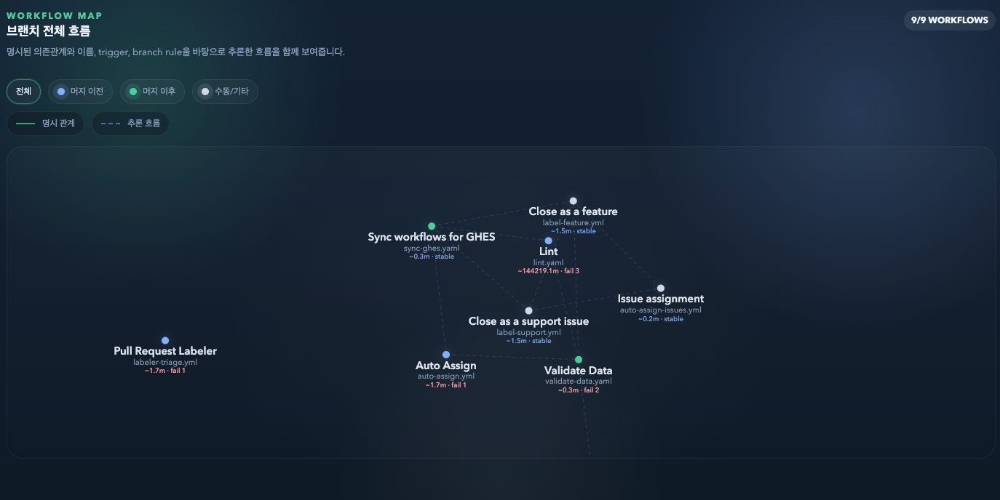
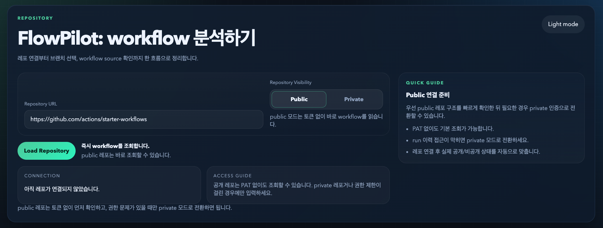
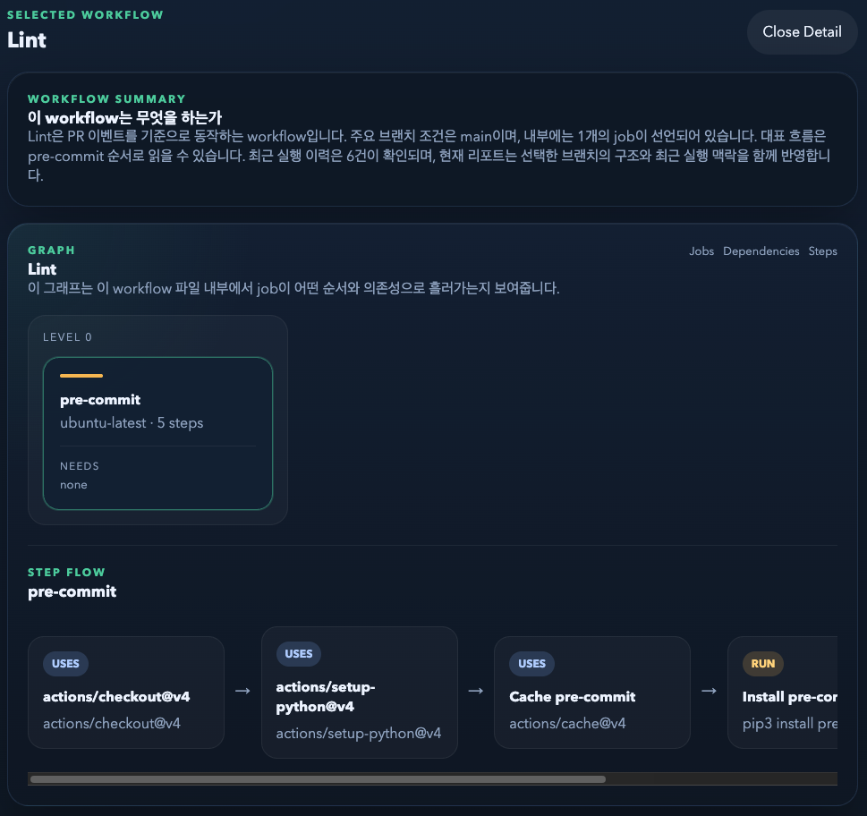
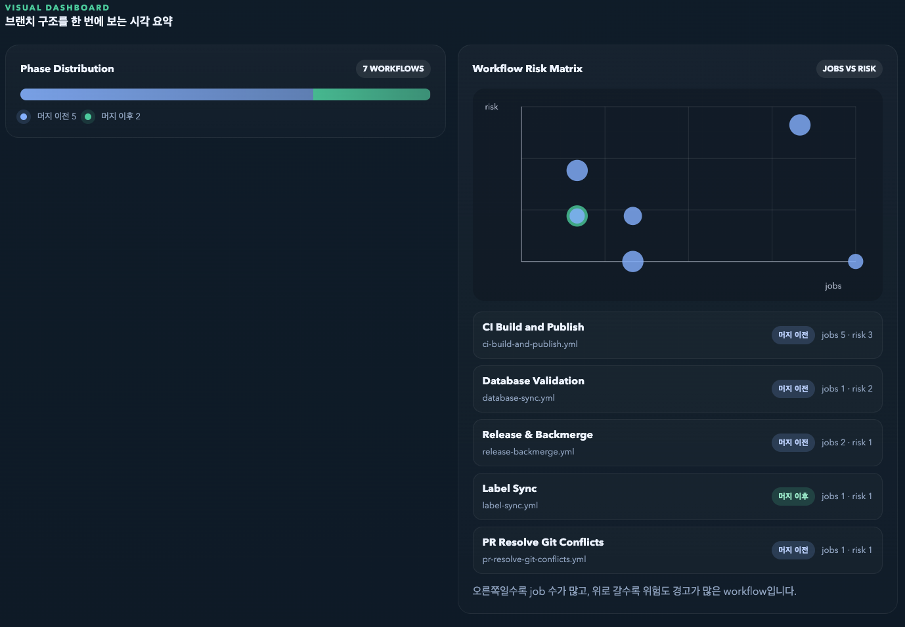
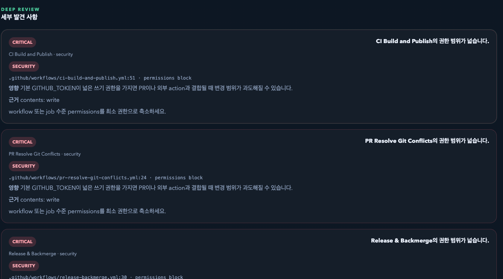

# FlowPilot

> GitHub Actions 워크플로우를 시각화하고, AI 기반 CI 리뷰 리포트를 생성하는 도구



레포지토리 URL 하나만 입력하면 브랜치 전체의 워크플로우 구조를 자동으로 스캔하고,
관계를 추론하여 시각화하며, 보안·안정성·성능 관점의 분석 리포트를 제공합니다.

---

## Features

**워크플로우 시각화**
- 브랜치 기준 전체 워크플로우를 Force-directed Graph로 표현
- `workflow_run` / `workflow_call` 명시 관계 + 이름·trigger·branch rule 기반 추론 흐름
- 머지 이전 / 머지 이후 / 수동 필터링

**Job & Step 분석**
- 선택한 워크플로우의 Job 의존관계를 DAG로 시각화
- Step 단위 action 흐름까지 드릴다운

**CI 리뷰 리포트**
- Gemini AI + 휴리스틱 분석 (AI 장애 시 자동 폴백)
- Phase Distribution, Risk Matrix, Category Heatmap, Coverage Matrix
- Workflow Inventory 테이블
- Critical / Warning / Info 단위 Finding + YAML 소스 위치 연결
- HTML 리포트 내보내기

---

## Screenshots

| 레포 연결 | Job DAG & 상세 |
|:-:|:-:|
|  |  |

| 비주얼 대시보드 | Deep Review |
|:-:|:-:|
|  |  |

---

## Tech Stack

| 영역 | 기술 |
|------|------|
| Frontend | React 18, TypeScript, Vite, react-force-graph-2d |
| Backend | NestJS, TypeScript |
| AI | Google Gemini API |
| Infra | Docker, nginx, pnpm monorepo |

---

## Quick Start

### Requirements

- Node.js 20+
- pnpm 10+

### Setup

```bash
pnpm install
cp backend/.env.example backend/.env
cp frontend/.env.example frontend/.env
```

### Local Dev

```bash
pnpm dev:start   # frontend + backend 동시 실행
pnpm dev:stop    # 종료
```

- Frontend: `frontend/.env`의 `PORT`, 없으면 `frontend/.env.example`, 최종 기본값 `5173`
- Backend: `backend/.env`의 `PORT`, 없으면 `backend/.env.example`, 최종 기본값 `3001`

### Docker

```bash
pnpm docker:start   # build + compose up
pnpm docker:stop     # compose down
```

- App: `http://localhost:8080`
- `/api` 요청은 nginx가 backend로 프록시

---

## Environment Variables

환경변수 파일이 3개 있습니다. **실행 방식에 따라 수정할 파일이 다릅니다.**

| 실행 방식 | 수정할 파일 | 설명 |
|-----------|------------|------|
| `pnpm dev:start` (로컬 개발) | `frontend/.env` + `backend/.env` | 각 서비스가 자기 `.env`를 직접 읽음 |
| `docker compose` (Docker 배포) | 루트 `.env` | docker-compose.yml이 루트 `.env`를 읽어 컨테이너에 주입 |

### 로컬 개발: `frontend/.env` + `backend/.env`

```bash
cp frontend/.env.example frontend/.env
cp backend/.env.example backend/.env
```

**`backend/.env`**

| 변수 | 설명 | 기본값 |
|------|------|--------|
| `PORT` | API 서버 포트 | `3001` |
| `FRONTEND_URL` | CORS 허용 origin | `http://localhost:5173` |
| `GEMINI_API_KEY` | Gemini 분석 키 (없으면 휴리스틱만 사용) | — |

**`frontend/.env`**

| 변수 | 설명 | 기본값 |
|------|------|--------|
| `PORT` | Dev 서버 포트 | `5173` |
| `VITE_API_URL` | Backend URL | `http://localhost:3001` |

`.env`가 없으면 `.env.example` 값을 기본값으로 사용합니다.

### Docker 배포: 루트 `.env`

```bash
cp .env.example .env
```

**`.env`**

| 변수 | 설명 | 기본값 |
|------|------|--------|
| `FRONTEND_PORT` | 외부 노출 포트 (브라우저 접속용) | `8080` |
| `BACKEND_PORT` | API 서버 포트 | `3001` |
| `FRONTEND_URL` | CORS 허용 origin | `http://localhost:8080` |
| `VITE_API_URL` | Frontend → Backend 경로 (nginx 프록시 시 `/api`) | `/api` |
| `GEMINI_API_KEY` | Gemini 분석 키 | — |
| `GEMINI_MODEL` | Gemini 모델명 | `gemini-2.5-flash` |

> **주의**: `VITE_API_URL`은 빌드 타임에 번들에 박히므로, 변경 후 `docker compose up -d --build`로 재빌드해야 반영됩니다.

---

## Usage

1. GitHub 레포지토리 URL 입력
2. Public / Private 선택 (Private은 PAT 필요)
3. 브랜치 선택 → 워크플로우 자동 스캔
4. **Workflow Map**에서 전체 흐름 확인, 노드 클릭으로 상세 진입
5. **CI Review Report**에서 분석 결과 및 대시보드 확인
6. Finding 클릭 시 해당 YAML 소스 위치로 이동
7. HTML 리포트로 내보내기 가능

### PAT 권장 권한 (Private 레포)

- `Metadata: Read-only`
- `Contents: Read-only`
- `Actions: Read-only`

---

## Project Structure

```
flowpilot/
├── frontend/    # React + Vite UI
├── backend/     # NestJS API
├── docs/        # 가이드, 아키텍처, 기획 문서
├── scripts/     # 개발/배포 스크립트
└── README.md
```

---

## Scripts

| 명령어 | 설명 |
|--------|------|
| `pnpm dev:start` | 로컬 개발 서버 실행 |
| `pnpm dev:stop` | 로컬 개발 서버 종료 |
| `pnpm docker:start` | Docker 빌드 + 실행 |
| `pnpm docker:stop` | Docker 종료 |
| `pnpm build` | 프론트 + 백엔드 빌드 |
| `pnpm lint` | TypeScript 타입 체크 |
| `pnpm test` | 프론트엔드 유닛 테스트 |

---

## Documentation

- [사용 가이드](docs/06-guide.md)
- [프론트엔드 아키텍처](docs/07-frontend-architecture.md)
- [백엔드 아키텍처](docs/08-backend-architecture.md)
- [프로젝트 가이드 (PDF)](docs/flowpilot-guide.pdf)
