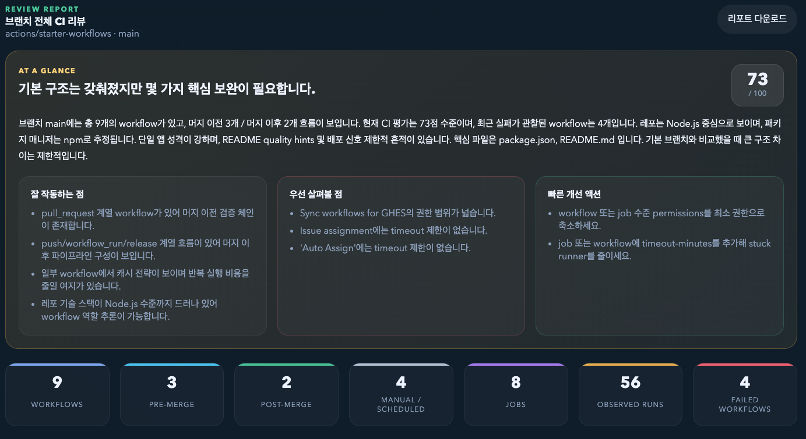
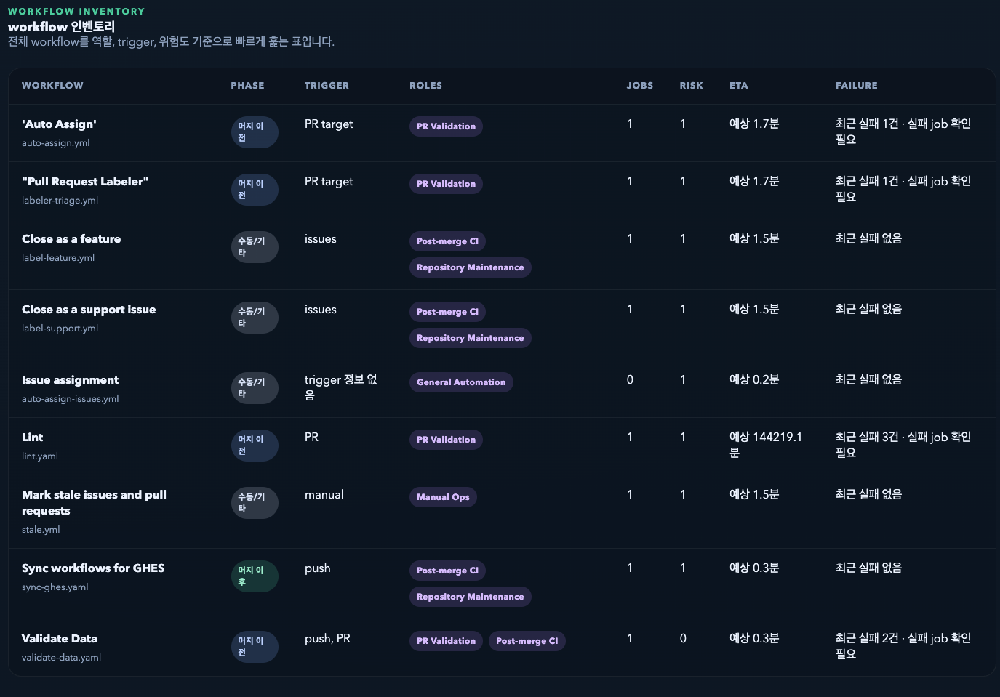
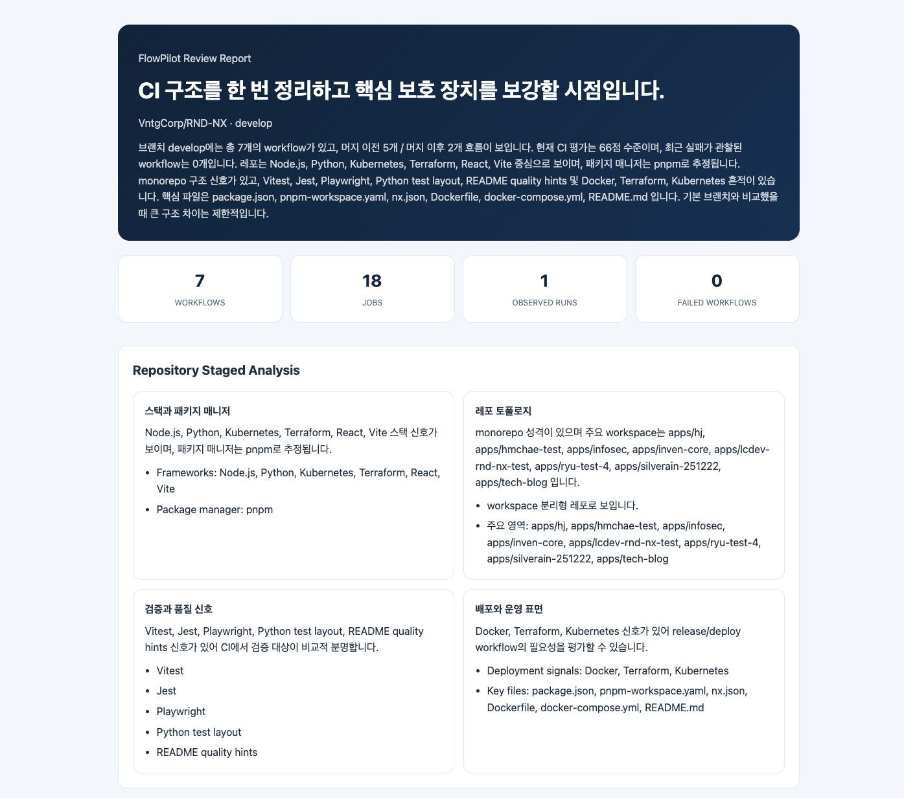

# FlowPilot Guide — GitHub Actions 워크플로우 분석 도구

---

## 1. 프로젝트 개요

### 프로젝트명
**FlowPilot** — GitHub Actions 워크플로우 시각화 및 CI 리뷰 도구

### 개발 배경
GitHub Actions 기반 CI/CD 파이프라인이 복잡해질수록 다음과 같은 문제가 발생합니다.

- 워크플로우 간 의존관계를 YAML 파일만으로는 한눈에 파악하기 어렵다
- 실패 원인 추적, 보안 취약점 점검 등 수작업 분석에 시간이 과도하게 소요된다
- 브랜치별 CI 구조 차이를 비교할 수 있는 도구가 없다
- 신규 인원이 CI 파이프라인 전체 흐름을 이해하는 데 진입 장벽이 높다

### 해결하려는 것
GitHub 레포지토리 URL 하나만 입력하면, **워크플로우 구조를 자동으로 스캔·시각화하고 AI 기반 분석 리포트를 생성**하여 CI/CD 파이프라인의 현황을 빠르게 파악하고 개선 포인트를 도출할 수 있게 합니다.

---

## 2. 기술 스택

| 영역 | 기술 |
|------|------|
| Frontend | React 18, TypeScript, Vite |
| Backend | NestJS, TypeScript |
| 시각화 | react-force-graph-2d (D3 기반) |
| AI 분석 | Google Gemini API (휴리스틱 폴백) |
| 인프라 | Docker, nginx, pnpm monorepo |

---

## 3. 주요 기능 및 화면

### 3-1. 레포지토리 연결

GitHub URL과 접근 권한(Public/Private)을 입력하면 브랜치 목록을 불러오고 워크플로우 스캔을 시작합니다.


- Public 레포는 토큰 없이 바로 분석 가능
- Private 레포는 GitHub PAT(Fine-grained Token)로 인증
- 브랜치 선택 후 해당 브랜치의 `.github/workflows` 를 자동 스캔

---

### 3-2. 워크플로우 맵 (브랜치 전체 흐름)

선택한 브랜치의 모든 워크플로우를 **Force-directed Graph**로 시각화합니다.


- **노드** = 개별 워크플로우, **엣지** = 실행 의존관계
- 실선(명시 관계): `workflow_run`, `workflow_call`로 직접 연결된 흐름
- 점선(추론 흐름): 이름, trigger, branch rule을 기반으로 추론한 관계
- 머지 이전 / 머지 이후 / 수동 필터로 phase별 분류 확인 가능

---

### 3-3. Job DAG 및 상세 분석

워크플로우를 선택하면 내부 Job 구조를 DAG로 보여주고, Step 단위까지 드릴다운할 수 있습니다.


- 워크플로우 요약: 트리거, 브랜치 조건, Job 수, 최근 실행 이력
- Job 의존관계를 Level 단위로 시각화
- Step Flow: 각 Job 내부의 action 사용 흐름을 순서대로 표시

---

### 3-4. CI 리뷰 리포트

브랜치 전체 CI 구조에 대한 종합 분석 리포트를 자동 생성합니다.



- AI + 휴리스틱 분석으로 전체 건강도 점수 산출
- 보안(Security), 안정성(Reliability), 성능(Latency), 중복(Maintenance) 카테고리별 점검
- 핵심 보강 포인트를 한 줄로 요약

---

### 3-5. 비주얼 대시보드

리포트 상단에 브랜치 CI 구조를 한눈에 조망할 수 있는 시각 요약을 제공합니다.


- **Phase Distribution**: 머지 이전/이후 워크플로우 비율
- **Workflow Risk Matrix**: Job 수 × 리스크 수준 버블 차트
- 워크플로우별 phase, job 수, risk 수준 요약 리스트

---

### 3-6. 워크플로우 인벤토리

모든 워크플로우를 테이블 형태로 정리하여 trigger, role, phase, 실패 이력 등을 비교할 수 있습니다.



- 워크플로우별 phase(머지 이전/이후), trigger, role 분류
- Job 수, 최근 실패 여부, 예상 소요 시간 표시
- 클릭 시 해당 워크플로우 상세로 이동

---

### 3-7. Deep Review (세부 발견 사항)

카테고리별로 발견된 이슈를 severity(critical/warning/info) 기준으로 정렬하여 보여줍니다.


- **Critical**: 보안 권한 범위 초과, permissions block 누락 등
- **Warning**: 타임아웃 미설정, 캐시 미사용 등 안정성/성능 이슈
- 각 항목에 YAML 소스 위치(파일:라인)를 함께 표시하여 즉시 확인 가능
- 구체적인 수정 권고 사항 제공

---

### 3-8. 리포트 내보내기

분석 결과를 HTML로 내보내 팀 내 공유 및 아카이빙에 활용할 수 있습니다.



- Repository Staged Analysis: 프레임워크, 패키지 매니저, 테스트 도구 자동 감지
- 검증 흐름/배포 흐름/관리 흐름별 CI 커버리지 분석
- 독립 HTML 파일로 다운로드 가능

---

## 4. 시스템 아키텍처

```
┌─────────────────────────────────────────────────────┐
│                     사용자 브라우저                      │
│  ┌──────────────────────────────────────────────┐   │
│  │           React + Vite (Frontend)            │   │
│  │  - 레포 연결 / 워크플로우 맵 / Job DAG        │   │
│  │  - CI 리뷰 리포트 / HTML 내보내기             │   │
│  └──────┬──────────────────────┬────────────────┘   │
│         │ GitHub REST API      │ /api/*              │
│         ▼                      ▼                     │
│   GitHub API             NestJS Backend              │
│   (워크플로우 YAML,       (분석 엔진)                 │
│    실행 이력, 브랜치)      ┌──────────┐              │
│                           │ Gemini AI │              │
│                           │ + 휴리스틱 │              │
│                           └──────────┘              │
└─────────────────────────────────────────────────────┘
```

- Frontend → GitHub API: 워크플로우 YAML, 실행 이력 직접 조회
- Frontend → Backend `/api/analyze`: AI 기반 워크플로우 분석 요청
- Backend: Gemini API 호출 → 실패 시 휴리스틱 분석으로 자동 폴백

---

## 5. 핵심 성과

| 항목 | 내용 |
|------|------|
| 워크플로우 시각화 | YAML 파일 기반 자동 DAG 생성 및 관계 추론 |
| AI 분석 리포트 | 보안·안정성·성능·중복 4개 축 자동 점검 |
| 진입 장벽 해소 | URL 입력만으로 CI 전체 구조 즉시 파악 |
| 리포트 공유 | HTML 내보내기로 팀 내 공유 가능 |
| 무중단 분석 | Gemini 장애 시 휴리스틱 폴백으로 서비스 유지 |

---

## 6. 기술적 특징

- **모노레포 구조**: pnpm workspace로 frontend/backend 통합 관리
- **워크플로우 관계 추론 엔진**: trigger, branch rule, 이름 패턴, intent tag 기반 다중 신호 추론
- **리스크 스코어링**: Job 복잡도 × 카테고리별 점수로 정량적 위험도 산출
- **Docker 원클릭 배포**: `docker-compose up` 으로 nginx + backend 즉시 실행
- **TypeScript Full-stack**: 프론트·백엔드 동일 언어로 타입 안전성 확보

---

## 7. 향후 확장 방향

- PR 자동 생성: 분석 결과 기반 워크플로우 수정 PR 자동 제안
- 멀티 레포 분석: 조직 단위 CI 구조 비교
- GitLab CI / CircleCI 지원 확대
- 사용자 계정 및 리포트 이력 관리
- 실시간 모니터링 대시보드 연동

---

> **FlowPilot**은 CI/CD 파이프라인의 복잡성을 시각화와 AI 분석으로 해소하여,
> 개발팀이 더 안전하고 효율적인 배포 흐름을 만들 수 있도록 돕는 도구입니다.
